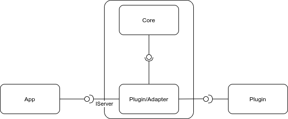

`smart-core` smart core prototype project

Simplifications:
- Single plugin adapter
- Fixed plugin configuration
- No plugin interface and version control 

Here is some diagram what we are going to construct:


Prerequisites:
```shell script
go get -u -v github.com/go-swagger/go-swagger/cmd/swagger
```
Verify swagger.yml:
```shell script
make validate
```

Generate go-swagger files:
```shell script
make gen
```

Build project:
```shell script
make build
```
For other options look into Makefile
